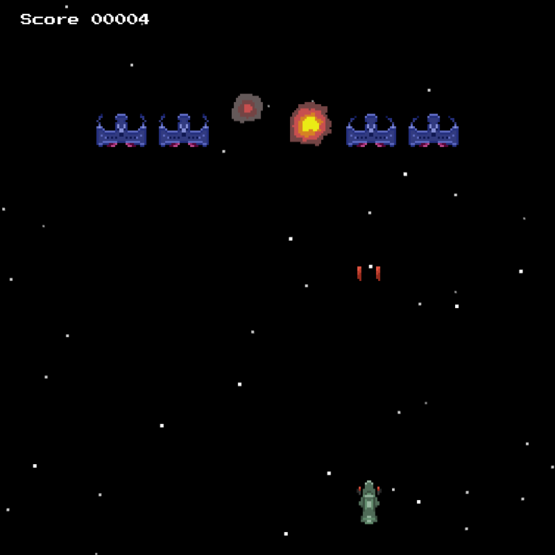

# WeltraumEindringlinge

It's a game! Control your spaceship, earth last's hope of defense, and shoot down the impolite ruffians.

## Playing

In the game, control your spaceship with `a` and `d` to move left or right. Fire at enemy things using space. Win by destroying everything!

You can even play it online:

[https://jasminefields.net/studio/WeltraumEindringlinge/](https://jasminefields.net/studio/WeltraumEindringlinge/)

Please note that this page might not carry the newest version.

### Building

First install all packages, preferably with `yarn install`.

Then, you can run a development version with `make dev`, or equivalently `yarn run webpack-dev-server`. Open `localhost:32011`.

You can also build a distributable version with `make build`.

## Credits

### Press Start 2P

This game uses the font `Press Start 2P`, published under the SIL Open Font Licence. See [SIL Licence](assets/fonts/PressStart2P/OFL.txt) for details.

### Hubble Space Photos

The game uses (adopted versions of) images from the Hubble Space Telescope, available at [https://www.spacetelescope.org/images/archive/category/nebulae/](https://www.spacetelescope.org/images/archive/category/nebulae/), specifically the following:

* https://www.spacetelescope.org/images/heic1608a/ (The Bubble Nebula)
* https://www.spacetelescope.org/images/heic1808a/ (The Lagoon Nebula)

The images are licenced under [CC BY 4.0](https://creativecommons.org/licenses/by/4.0/).

### Sounds

Sound effects have been taken from the `Essential Retro Video Game Sound Effects Collection` by Juhani Junkala, which is licensed under the [CC0 License](https://creativecommons.org/publicdomain/zero/1.0/), and available at [OpenGameArt.org](https://opengameart.org/content/512-sound-effects-8-bit-style).

The background music is also from Juhani Junkala from the `5 Chiptunes (Action)`, also licensed under the [CC0 License](https://creativecommons.org/publicdomain/zero/1.0/), available as well as [OpenGameArt.org](https://opengameart.org/content/5-chiptunes-action).
